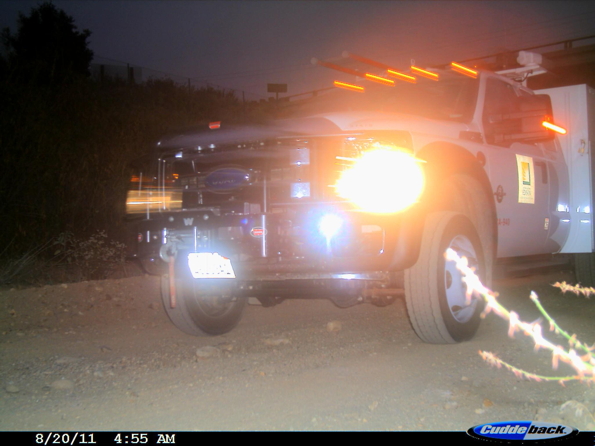

# caltech-trailcam-curation

This is a project about data collection, curation, and manipulation in regards to trail cameras. I'm interested in how trail cameras attempt to digitize nature in the abscence of human prescence, despite how observer effects make that impossible.

## Gathering the Data

- To start, I downloaded this [Caltech Southwest Trailcams Dataset](https://lila.science/datasets/caltech-camera-traps). 

- Some information about the data:
  
  > This data set contains 243,100 images from 140 camera locations in the Southwestern United States, with labels for 21 animal categories (plus empty), primarily at the species level (for example, the most common labels are opossum, raccoon, and coyote), and approximately 66,000 bounding box annotations. Approximately 70% of images are labeled as empty.

- I first downloaded the data set in its entirety, and then decided to isolate a subset of a ~2,500 images from only 5 locations: 0, 17, 29, 36, and 62. These were locations that I found compositionally interesting, and that took striking images of animals. 

|  |      |
| -------------------------------------------------------------------------------------------- | -------------------------------------------------------------------------------------------- |
|  |  |

*Four of my favorite images from my subset*

## Analyzing the Data

- I decided to use a tool called [Addax AI](https://addaxdatascience.com/addaxai/) to classify the contents of the images, since I  did not realize that the .json file that I used to isolate images by location also contained labeling information. Nevertheless it was an informative process using the tool, and I would do so again if dealing with unlabeled trailcam data.

- Here are the results:

- One camera I selected most frequently vehicles, explaining their prevalence. I liked the location for the interesting artifacts of the camera shutter that occured within its photos.

|  |  |
| -------------------------------------------------------------------------------------------------------------------- | -------------------------------------------------------------------------------------------------------------------- |
|  |  |

## UMAP and t-SNE Mosaic

- I then used this tool to create mosaics of my data set:
  
  [GitHub - golanlevin/ImageRearranger: Arrange collections of image into mosaics, according to their similarity.](https://github.com/golanlevin/ImageRearranger)

- In order to use the tool the images needed to be uniformly cropped and square, and I learned how to write batch scripts using ffmpeg to accomplish this.

*Here are all the cars in a mosaic*

*Here are all the coyotes in a mosaic*

## CivitAI LoRA

- The last thing I wanted to do was train a LoRA based on the data I had collected. There were two things I was most interested in capturing in a LoRA. 
  
  - The first was the unique quality of the nighttime flash photography of the animals. I selected most of my camera locations because they used CuddleBack trail cameras, which take night time photos in color with flash. 
  
  - The second thing I was looking to capture were the unique image artifacts the CuddleBack produced when they glitched out. These artifacts are at times very appealing, and I was interested in searching for more artifacts like them in the latent space.

|  |  |
| ------------------------------------------------------------------------------------------------------------- | ------------------------------------------------------------------------------------------ |
|                     |  |

- I ended up curating a collection of 128 images I wanted to use to train the LoRA. These images can be found in `Caltech-Camera-Trap-Images/Favorites`. I chose a combination of images of animals I found interesting and images that had unique visual artifacts. I decided to not include any images of vehicles.

- I then used [Civitai](https://civitai.com/) to train the LoRA using SDXL 1.0. The autolabeling system was not functioning at the time, so I hand-tagged the images based on animal present, time of day, and prescence of artifacts. I then trained the model, and here are some of my favorite results:

|  |                     |
| ---------------------------------------------------------------------------------------------- | ---------------------------------------------------------------------------------------------- |
|  |  |

- I made these generations using [ComfyUI](https://www.runcomfy.com/), whyich allowed me to tweak the CLIP Strength and Model Strength to affect how much the LoRA affected my prompts and the final results.
- Just for fun, I decided to make a t-SNE mosaic of all my generations as well, just to get a small visualization of the range of the LoRA.

*A mosaic of images generated using the LoRA*

- Because the LoRA is just a filter guiding what where in SDXL 1.0's Latent Space prompts map to and images produce, I'd be interesting in training a GAN from scratch to create a space only informed by my trail images, and not by all the images SDXL was trained on

## Conclusion

- My expectation going into this project was to collect a vast amount of data, process all of it, and get some profound result from the whole. As I continued to analyze it however, I found myself filtering, sifting, and tailoring the data in increasingly manual ways. Ultimately, what I've come to love most about this data set are the select few I've picked amongst the thousands and decided to showcase within this document. Although there are maybe 5 images my mind keeps returning to, I think it is the context of the thousands from which I chose those 5 from which makes them so meaningful to me.